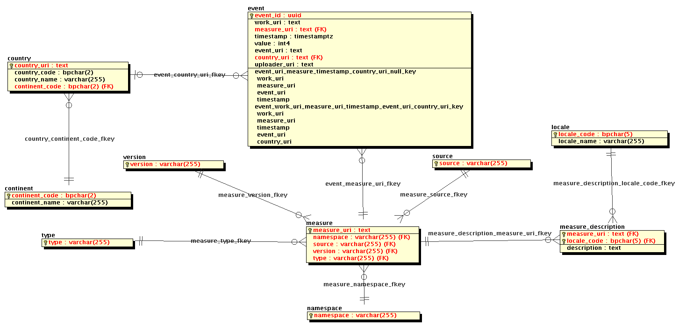

# Metrics Database
Postgres database of publication usage statistics

## Instructions

Start a database instance:
`
docker run --name metrics_db -e POSTGRES_PASSWORD=mysecretpassword -e POSTGRES_DB=metrics_db -e POSTGRES_USER=obp -d openbookpublishers/metrics_db
`

## Schema

